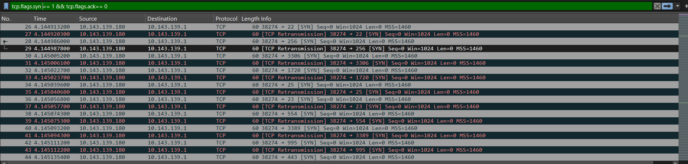
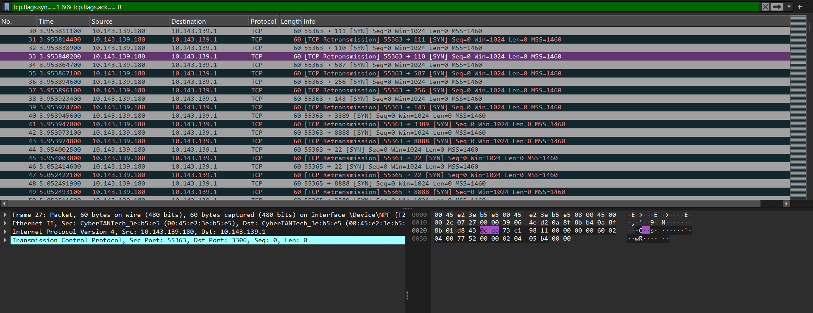

## 1. مقدمة المشروع (Project Overview):
هذا المشروع يحاكي دورة حياة الحادث الأمني (Incident Life Cycle) بشكل متكامل؛ بدءاً من الكشف عن الـ (Stealth SYN Scan)، مروراً بتحليل الحزم لعزل التهديد، وصولاً إلى تطبيق الـ (Mitigation) وتوثيق النتائج كخبير أمن سيبراني.
## 2. مرحلة الكشف (Detection Phase):

النتيجة: Targeted Reconnaissance) (Identified: تم رصد محاولة مسح منافذ منظمة من العنوان '10.143.139.180' تستهدف الخدمات الحساسة.

## 3. إجراءات الحماية (Mitigation Steps):

الإجراء: أنشَأتُ قاعدة مخصصة في جدار الحماية (Windows Firewall) لحتى احظر جميع الاتصالات الواردة من الآيبي المهاجم.
.
## 4. تحليل ما بعد الحظر (Post-Mitigation Analysis)
النتيجة الأولى: (Increased Attacker Resource Consumption):
ظهور حزم (TCP Retransmission) بكثافة، مما يُظهر استنزاف موارد المهاجم.
النتيجة الثانية: (Service Obfuscation): تغير حالة المنافذ في "Nmap" إلى "Filtered".

## 5. الخُلاصة الفنية (Technical Conclusion)
أثبتت نجاح استراتيجية الدفاع من خلال مراقبة سلوك الـ (TCP Retransmission)، حيث أدى الحظر إلى إجبار المهاجم على تكرار محاولات الاتصال دون تلقي أي استجابة من نظام ويندوز (Silent DropSilent Drop)."
